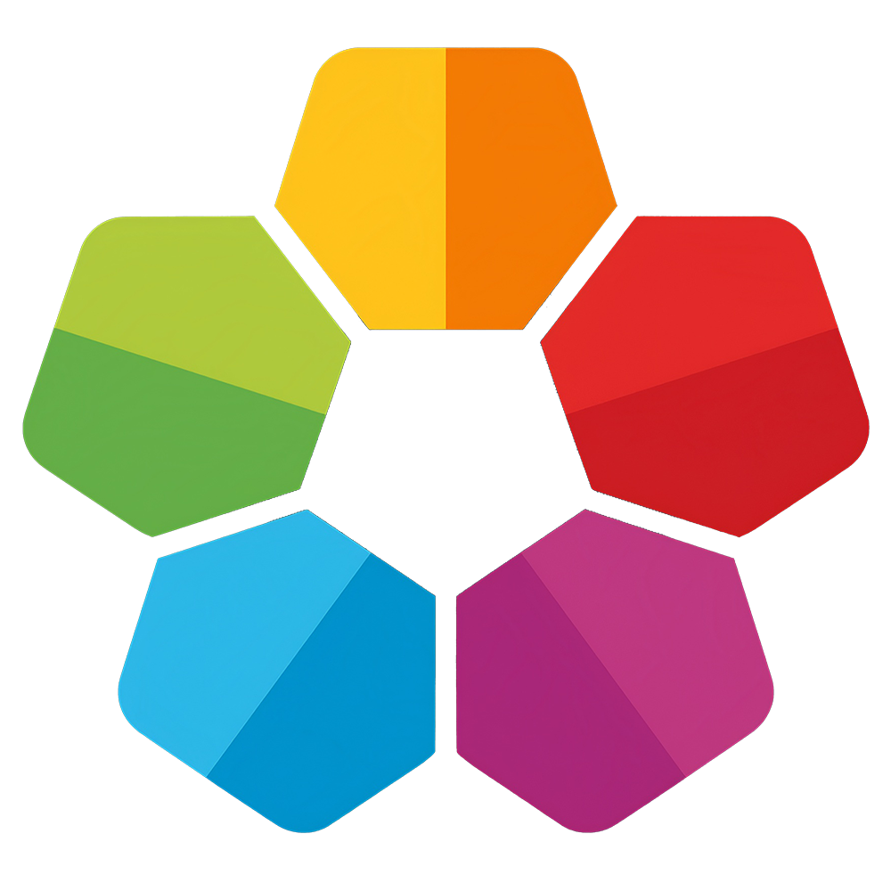

# Korers

**Local-first password manager. No cloud. No subscription. No compromises.**

Built for individuals, families, and security-conscious teams.

[Request Early Access](#early-access) · [Learn More](https://korers.app) · [Security Policy](SECURITY.md)

---

## What is Korers?

Korers is an open source password manager that runs entirely on your device.
Your data never leaves your machine unless you explicitly choose otherwise.
No account required. No cloud dependency. No seat licensing.

It is built for three groups of people:

- Individuals who want secure password management without a monthly subscription
- Families who want to share access without sending passwords through chat apps
- Teams and enterprises who need auditable, compliant credential management without vendor lock-in

---

## Why Korers?

Most password managers make the same trade: convenience in exchange for cloud dependency.
Korers makes a different trade: full local control with no compromise on security or features.

| Feature | Korers | Typical cloud-based managers |
|---|---|---|
| Price | Free | $4 to $8 per user per month |
| Open Source | Yes | Rarely |
| Offline-first | Yes | No or limited |
| Duress Mode | Yes | Not available |
| Travel Mode | Yes | Rarely available |
| Offboarding SLA | Under 5 seconds | Not defined |
| HMAC Audit Log | Yes | Event logs only |
| TPM 2.0 binding | Yes | Not available |
| On-premise IdP | Yes | No or limited |

---

## Core Features

- AES-256-GCM encryption with Argon2id key derivation
- TPM 2.0 hardware key binding on Windows and Linux
- HMAC-SHA256 chained audit log - manipulation is detectable
- Offboarding engine with parallel execution and SLA under 5 seconds
- Duress Mode - opens a decoy vault under coercion
- Travel Mode - hides selected content at border crossings
- SSO via OIDC and SAML 2.0 - works with Entra ID, Okta, Google Workspace, and Keycloak on-premise
- SCIM provisioning with RBAC policy sync and vault assignment
- Browser extension for Chrome, Edge, and Firefox - no app store required
- Mobile app for iOS and Android
- 20 entry types including SSH certificates, crypto wallets, and API keys
- Blast Radius calculation - monetized impact per compromised entry
- Shadow IT detection with US cloud sovereignty flag
- Full offline operation - no internet connection required

---

## Status

Korers is in active development. The desktop platform releases in Q3 2026.

- Core engine: complete
- Desktop app: complete, internal testing
- Browser extension: complete, internal testing
- Mobile app: complete, internal testing
- SSO / SCIM stack: complete
- Public release: Q3 2026

**This repository currently contains no source code.**
Code will be published with the Q3 2026 release.
If you star this repository now, you will be among the first to know when it drops.

---

## Early Access

Korers will not launch publicly to everyone at once.

The first release goes to 1,000 selected individuals, teams, and organizations who will test the product and shape its direction before wide availability.

We are looking for:

- Security researchers and professionals
- IT administrators and DevSecOps teams
- Small to mid-size teams with real credential management needs
- Developers who want to contribute or audit the codebase
- Organizations with GDPR, NIS2, or BSI compliance requirements

**How to apply:**

1. Star this repository - this signals interest and reserves your place in the queue
2. [Open an Early Access Request](https://github.com/jamone-de/korers/issues/new?template=early-access.yml) - fill out the template so we can understand your use case
3. [Introduce yourself in Discussions](https://github.com/jamone-de/korers/discussions/new?category=stargazer-introductions) - tell the community who you are and why you are here
4. We review applications manually and reach out directly

We are not accepting everyone. We are looking for people who will actually use it and tell us what breaks.

---

## Technology

- Core Engine: Rust
- Desktop: Tauri 2.x + React + TypeScript
- Mobile: React Native + Expo
- Database: SQLite (local, bundled)
- Encryption: AES-GCM + Argon2
- Key exchange: X25519 + HKDF
- TLS: Sovereign Root CA via rcgen + rustls
- Audit: HMAC-SHA256 chained log

---

## Security

We take security seriously. If you find a vulnerability, please do not open a public issue.

Read our [Security Policy](SECURITY.md) for responsible disclosure instructions.

---

## License

MIT License. See [LICENSE](LICENSE) for details.

This means you can use, modify, and distribute Korers freely.
It also means there is no warranty. Use it at your own risk.

---

## Stay Updated

- Star this repository to get notified on release
- Watch this repository for announcements
- Follow [@jamone-de](https://github.com/jamone-de) for development updates

---

**Built in public. Shipped when ready. No hype, just code.**

